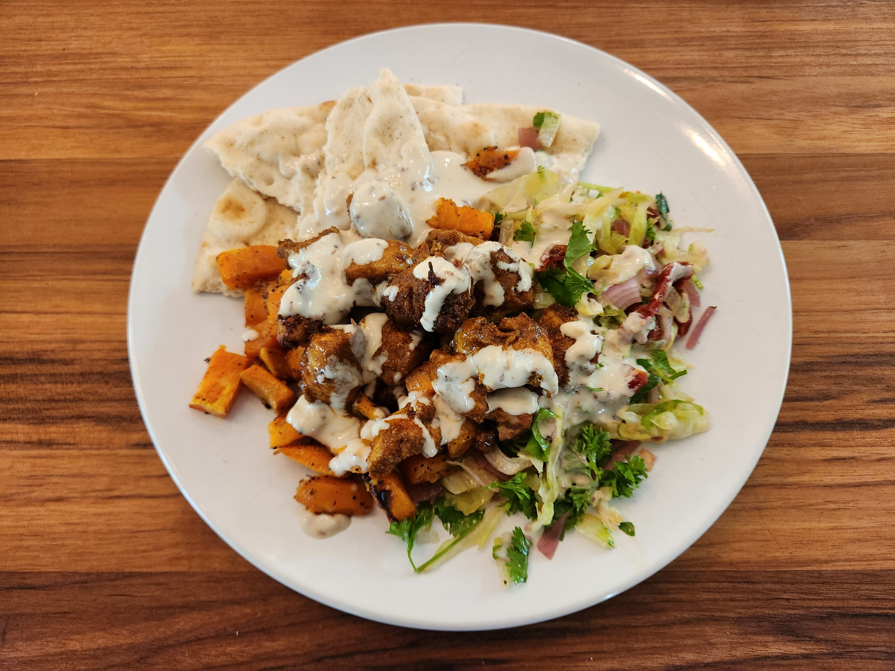

Lovers' Digest
==============

================
Marry Me Chicken
================

Did Daniel cook a dish with "marry me" in the name on the first date? Yes, indeed he did.

.. image:: _images/000_marry_me.jpg

================
Blueberry Scones
================

Only to be improved by sugar crystals sprinkled on top.

.. image:: _images/011_scones.jpg

===============
Chicken Piccata
===============

The first Phillips dinner supplied by Chef de Cuisine Daniel Duke.

.. image:: _images/060_piccata.jpg

===============
Beef Rogan Josh
===============

The first Indian dish, which was heartily endorsed by Komal.

.. image:: _images/022c_rogan_josh.jpg

============
Corn Chowder
============

The first soup that stole Laura's heart.

.. image:: _images/070_chowder.jpg

=====================
Roasted Tomato Quiche
=====================

One of four quiches prepared in a single night.

.. image:: _images/101_quiche.jpg

=================
Cinnamon Biscuits
=================

Even though these look so delicious, Laura still prefers the good ol' flully plain ones.

.. image:: _images/111_biscuits.jpg

===================
Superbowl Pinwheels
===================

Daniel and Laura, watching a sporting event? Couldn't be. Unless... there's food involved.

.. image:: _images/112_pinwheels.jpg

==============================
Chocolate-Covered Strawberries
==============================

Turns out a little bit of chocolate goes a long way.

.. image:: _images/131_strawberries.jpg

=======================
Lemon Artichoke Chicken
=======================

The best meal Daniel has ever made.

.. image:: _images/141_lemon_chicken.jpg

============
Baked Salmon
============

Unexpedtedly delicious. Served with hot honey cauliflower, roated potatoes, and (not pictured) homemade Ceasar salad.

.. image:: _images/160_salmon.jpg

================
Beautiful Omelet
================

The first meal Laura made for Daniel in months.

.. image:: _images/170_omelet.jpg

=====================
Honey Chipotle Salmon
=====================

Served with roasted cherry tomatoes, cucumber avocado feta salad, and Töst.

.. image:: _images/180_salmon.jpg

==============================
Sweet Potato and Curry Chicken
==============================

The second 10/10! Shredded lettuce sun-dried tomato salad courtesy of Laura, dare we not forget.

====================
Japanese BBQ at Home
====================

Dadiel tried his darndest, but by the end of the night, meats of at all levels of doneness had been served, from still alive to charred black. However, there were enough success to warrant another attempt in the not too distant future, hopefully. Plus, Laura made some nice sauce. Great job Laura!

.. image:: _images/200_cookout.jpg

=================
Blueberry Muffins
=================

Hailed by Laura's father as possibly the best muffins he has tasted - soft on the inside with a crispy streusel.

.. image:: _images/210_muffins.jpg

===========
Sumo Orange
===========

Beautifully arranged by a beautiful person. A perfect refreshment after a long afternoon of sanding and mowing.

.. image:: _images/220_sumo_orange.jpg

=================
Tomato Basil Soup
=================

First meal of 2025 using fresh herbs from the garden!

.. image:: _images/230_tomato_soup.jpg

