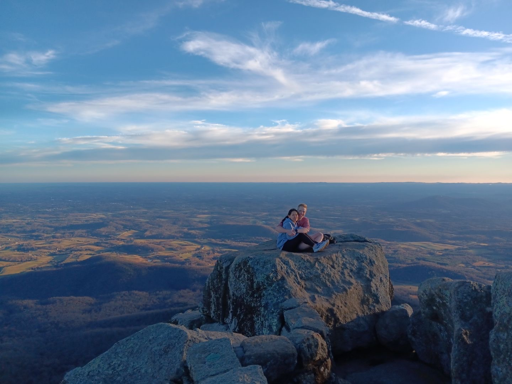

Adventures
==========

=========
Sharp Top
=========

.. error::
   A brave, sure-footed boyfriend might anticipate that jumping between rocks on a mountain peak with his shivering girlfriend in his arms would be taken as a chivalrous act demonstrating his agility.
   However, this expectation would be made in error, for his girlfriend will instead focus entirely on the danger in which his foolhearty leap of faith places her.

===========
Connecticut
===========

.. image:: _images/adventures/250720_CT.jpg

.. important::
   Ethiopian food rocks! But it is best enjoyed while not running a fever.

==============
Topsail Beach
==============

.. image:: _images/adventures/250823_topsail.jpg

.. warning::
   Laura is to too adorable! Beware, or she will make you miss her!

==============
Pilot Mountain
==============

.. image:: _images/adventures/251018_pilot.jpg

.. note::
   Though it may seem intimidating, outdoor climbing is actually pretty chill (at least, pretty chill for a natural like Laura). Also, it can also be astonishingly gorgeous (just like Laura).

==============
Stone Mountain
==============

The votes are in: this trip succeeded in every way possible.

.. image:: _images/adventures/251019_stone.jpg

.. tip::
   Some trips work, some trips flop.
   This partially depends on proper planning, but it also depends on luck: not because it requires luck for everything to go according to plan, but because things "falling into place" adds a certain charm to a trip that it cannot adorn otherwise.

===================
Connecticut, Again!
===================

Laura and Daniel did a much better job taking pictures of nature this trip than each other.
They may occasionally consider themselves not-half-bad-looking, but alas, sometimes nature steals the show.

.. image:: _images/adventures/251101_CT2_1.jpg

.. image:: _images/adventures/251103_CT2_2.jpg
