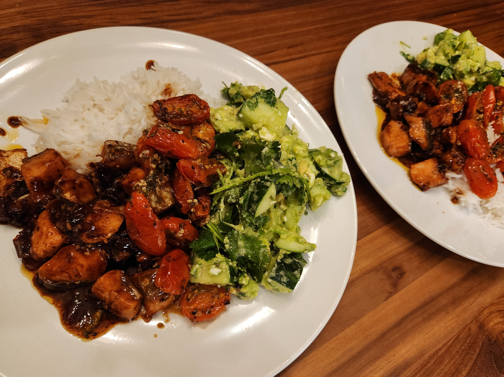
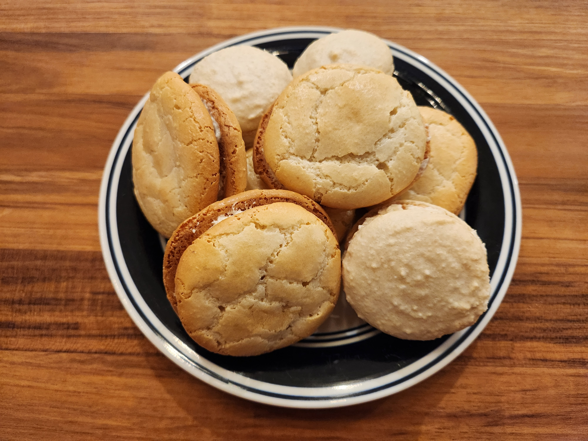

Lovers' Digest
==============

================
Marry Me Chicken
================

Did Daniel cook a dish with "marry me" in the name on the first date? Yes, indeed he did.

.. image:: _images/240929_marry_me.jpg

.. note:: Daniel had a few too many things on his mind to take a website-worthy photo of this meal, but the dish was tasty enough to be remade (and adequately photographed) several months later. But even that photo is not as pretty as the first attempt at the dish (pictured above), from before Daniel even met Laura (in the flesh, at least).

================
Blueberry Scones
================

Only to be improved by sugar crystals sprinkled on top.

.. image:: _images/241201_scones.jpg

===============
Beef Rogan Josh
===============

The first Indian dish, which was heartily endorsed by Komal.

.. image:: _images/241207_rogan_josh_3.jpg

.. important:: No one makes better jajik than Laura. Remember this, and utilize this.

===============
Chicken Piccata
===============

The first Phillips dinner supplied by Chef de Cuisine Daniel Duke.

.. image:: _images/241231_piccata.jpg

============
Corn Chowder
============

The soup that stole Laura's heart.

.. image:: _images/250101_chowder.jpg

.. tip:: Swap out one (or two) of the regular corn cans with creamed corn, and add extra broth to acheive the desired soupiness.

=====================
Roasted Tomato Quiche
=====================

One of four quiches prepared in a single night.

.. image:: _images/250121_quiche.jpg

.. tip:: Freezing a quiche after baking works perfectly fine, despite online warnings of soggy crusts and overbaking.

=================
Cinnamon Biscuits
=================

Even though these look so delicious, Laura still prefers the good ol' flully plain ones.

.. image:: _images/250208_biscuits.jpg

===================
Superbowl Pinwheels
===================

Daniel and Laura, watching a sporting event? Couldn't be. Unless... there's food involved.

.. image:: _images/250209_pinwheels.jpg

==============================
Chocolate-Covered Strawberries
==============================

Turns out a little bit of chocolate goes a long way.

=======================
Lemon Artichoke Chicken
=======================

The best meal Daniel has ever made (and the first official 10/10).

.. image:: _images/250612_lemon_chicken.jpg

.. note:: The second attempt at this recipe looked much prettier, and is thus pictured above. However, the stress of making it for Laura's parents after a stressful day at work compromised the quality of the meal, sadly. It still earned 5-star (and $28 market price) reviews from the parents, but both Laura and Daniel agreed it lacked flavor, likely due to insufficient salt and lemon juice.

============
Baked Salmon
============

Unexpedtedly delicious. Served with hot honey cauliflower, roated potatoes, and (not pictured) homemade Ceasar salad.

.. image:: _images/250322_baked_salmon.jpg

================
Beautiful Omelet
================

The first meal Laura made for Daniel in months.

.. image:: _images/250330_omelet.jpg

=====================
Honey Chipotle Salmon
=====================

Served with roasted cherry tomatoes, cucumber avocado feta salad, and Töst.

==============================
Sweet Potato and Curry Chicken
==============================

The second 10/10! Shredded lettuce sun-dried tomato salad courtesy of Laura, dare we not forget.

.. image:: _images/250406_mediterranean.jpg

====================
Japanese BBQ at Home
====================

"Dadiel" tried his darndest, but by the end of the night, meats at all levels of done-ness had been served, from still mooing to charred black. However, there was enough success to warrant another attempt in the not too distant future. Plus, Laura made some nice sauce. Great job Laura!

.. image:: _images/250411_cookout.jpg

.. tip:: When planning a grill night, make sure to start early enough to avoid darkness, and reschedule if the weather looks rainy or dreary. Also, when actually grilling, make sure the grill gets good and hot before cooking anything. Oh, and do most of the cooking with the lid closed, but don't leave it closed for too long and forget about it.

=================
Blueberry Muffins
=================

Hailed by Laura's father as possibly the best muffins he has tasted - soft on the inside with a crispy streusel on top.

.. image:: _images/250412_muffins.jpg

.. important:: Always refrigerate muffins when storing them!

===========
Sumo Orange
===========

Beautifully arranged by a beautiful person. A perfect refreshment after a long afternoon of sanding and mowing.

.. image:: _images/250413_sumo_orange.jpg

=================
Tomato Basil Soup
=================

Perfectly balanced sweetness from sugar and acidity from tomatoes, accented fresh oregano from the garden.

==============
Swirly Biscuit
==============

Most of the biscuits were normal, but the swirly one is quite cute and nice, even though the taste suffered.

.. image:: _images/250607_biscuits.jpg

.. caution:: Even when someone claims they will never tire of something, they still might do so in due time.

=====================
Tapenade Orzo Chicken
=====================

Hastily thrown together late on a Sunday night, but turned out unexpectedly good!

.. image:: _images/250905_tapenade_chicken.jpg

.. note:: Plate meals photograph better than bowl meals. Thus, this pictured dish is a remake from several months later.

============
Kale Ravioli
============

Accented with red onions, apple cider vinegar, butternut squash, and juicy roasted tomatoes.

.. note:: An astute observer will have noticed several meals with roasted tomatoes. This is no conincidence, as roasted tomatoes make Laura very, very happy.

================
Chicken Parmesan
================

From inception to production: 45 min flat.

.. image:: _images/250623_chicken_parm.jpg

.. tip:: Orzo cannot be beaten. Whether baked with pesto, sauteed with sun-dired tomatoes, or simply softened with olive oil, it always comes out delicious.

===========
Vegan Tacos
===========

Cauliflower and lentil tacos with mexican street corn and roasted tomatoes.

.. image:: _images/250625_vegan_tacos.jpg

=======
Cookies
=======

Choose your poison: chocolate chip or magic in the middle.

.. image:: _images/250706_cookies.jpg

.. note:: This time, the magic stayed in the middle! To acheive this, practice baking for several years.

=====
Tacos
=====

Made with special help from Bethany and Nanz.

.. image:: _images/250711_tacos.jpg

================
Chicken Marsala
================

.. image:: _images/250712_marsala.jpg

=========================
Salmon with Chickpea Kale
=========================

The simplicity, diversity, timeliness, and flawless execution of this meal earned it a 10/10!

.. image:: _images/250717_salmon_kale.jpg

============
Steak Dinner
============

Steaks courtesty of the steak master: Chef Lin Po-An.

.. image:: _images/250727_steak_poan_2.jpg

=======================
Raspberry Cheese Danish
=======================

.. image:: _images/250813_danish.jpg

================
Veggies and Eggs
================

Let it never be said that Laura does not take care of Daniel when he is sick.

.. image:: _images/250819_laura_veggies_2.jpg

==============
Chicken Tagine
==============

.. image:: _images/250824_tagine.jpg

==============
Spanish Paella
==============

Check out those charred rice bits :)

.. image:: _images/250829_paella.jpg

=====================
International Cookout
=====================

Cuisines represented: German (brats and red cabbage), Chinese (lotus root and shrooms), American (mac n' cheese and chicken skewer), Japanese (milk rools), Taiwanese (boba tea), and French (canele).

.. image:: _images/250906_cookout.jpg

=========
Macaroons
=========

.. warning:: Adding liquid flavor (such as orange or lemon juice) changes the consistency of the batter, resulting in flataroons. Also, make sure to sift the almond flour. Oh, and a little bit of butter cream goes a long way.

.. note:: Despite all the warnings and lessons learned, the flavor is surprisingly easy to hit just right.

===============
Dan Dan Noodles
===============

